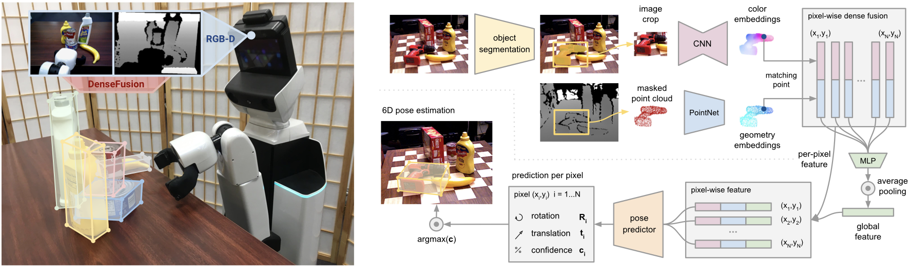
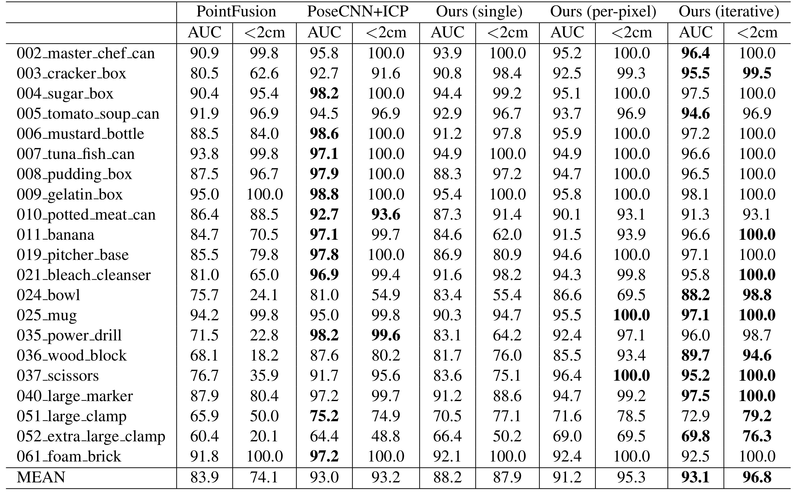
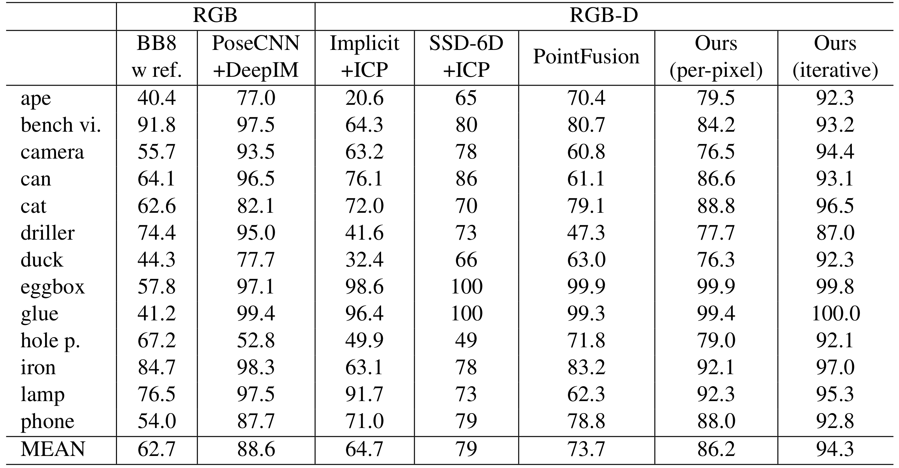
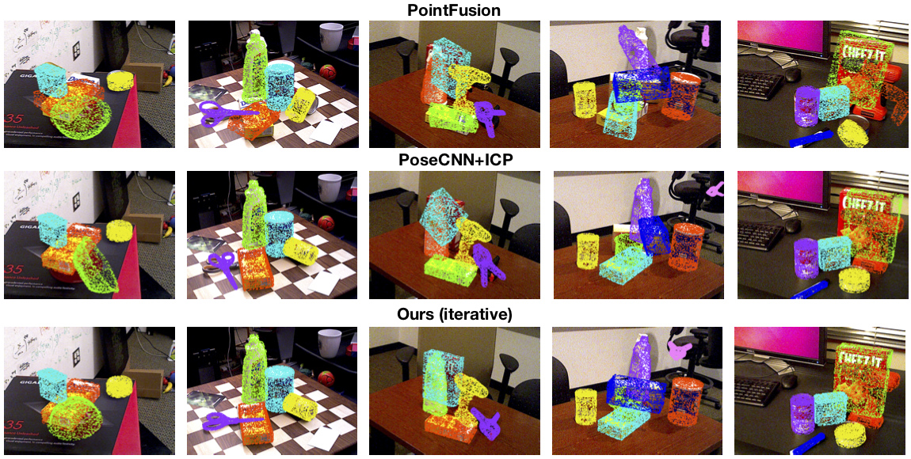

# DenseFusion

<p align="center">
	
</p>

## Table of Content
- [Overview](#overview)
- [Requirements](#requirements)
- [Code Structure](#code-structure)
- [Datasets](#datasets)
- [Training](#training)
- [Evaluation](#evaluation)
	- [Evaluation on YCB_Video Dataset](#evaluation-on-ycb_video-dataset)
	- [Evaluation on LineMOD Dataset](#evaluation-on-linemod-dataset)
- [Results](#results)
- [Trained Checkpoints](#trained-checkpoints)
- [Tips for your own dataset](#tips-for-your-own-dataset)
- [Citations](#citations)
- [License](#license)

## Overview

This repository is the implementation code of the paper "DenseFusion: 6D Object Pose Estimation by Iterative Dense Fusion"([arXiv](https://arxiv.org/abs/1901.04780), [Project](https://sites.google.com/view/densefusion), [Video](https://www.youtube.com/watch?v=SsE5-FuK5jo)) by Chen et al. at [Stanford Vision and Learning Lab](http://svl.stanford.edu/) and [Stanford People, AI & Robots Group](http://pair.stanford.edu/). The model takes an RGB-D image as input and predicts the 6D pose of the each object in the frame. This network is implemented using [PyTorch](https://pytorch.org/) and the rest of the framework is in Python. Since this project focuses on the 6D pose estimation process, we do not specifically limit the choice of the segmentation models. You can choose your preferred semantic-segmentation/instance-segmentation methods according to your needs. In this repo, we provide our full implementation code of the DenseFusion model, Iterative Refinement model and a vanilla SegNet semantic-segmentation model used in our real-robot grasping experiment. The ROS code of the real robot grasping experiment is not included.


## Requirements

* Python 2.7/3.5/3.6 (If you want to use Python2.7 to run this repo, please rebuild the `lib/knn/` (with PyTorch 0.4.1).)
* [PyTorch 0.4.1](https://pytorch.org/)
* PIL
* scipy
* numpy
* pyyaml
* logging
* matplotlib
* CUDA 7.5/8.0/9.0 (Required. CPU-only will lead to extreme slow training speed because of the loss calculation of the symmetry objects (pixel-wise nearest neighbour loss).)

## Code Structure
* **datasets**
	* **datasets/ycb**
		* **datasets/ycb/dataset.py**: Data loader for YCB_Video dataset.
		* **datasets/ycb/dataset_config**
			* **datasets/ycb/dataset_config/classes.txt**: Object list of YCB_Video dataset.
			* **datasets/ycb/dataset_config/train_data_list.txt**: Training set of YCB_Video dataset.
			* **datasets/ycb/dataset_config/test_data_list.txt**: Testing set of YCB_Video dataset.
	* **datasets/linemod**
		* **datasets/linemod/dataset.py**: Data loader for LineMOD dataset.
		* **datasets/linemod/dataset_config**: 
			* **datasets/linemod/dataset_config/models_info.yml**: Object model info of LineMOD dataset.
* **replace_ycb_toolbox**: Replacement codes for the evaluation with [YCB_Video_toolbox](https://github.com/yuxng/YCB_Video_toolbox).
* **trained_models**
	* **trained_models/ycb**: Checkpoints of YCB_Video dataset.
	* **trained_models/linemod**: Checkpoints of LineMOD dataset.
* **lib**
	* **lib/loss.py**: Loss calculation for DenseFusion model.
	* **lib/loss_refiner.py**: Loss calculation for iterative refinement model.
	* **lib/transformations.py**: [Transformation Function Library](https://www.lfd.uci.edu/~gohlke/code/transformations.py.html).
    * **lib/network.py**: Network architecture.
    * **lib/extractors.py**: Encoder network architecture adapted from [pspnet-pytorch](https://github.com/Lextal/pspnet-pytorch).
    * **lib/pspnet.py**: Decoder network architecture.
    * **lib/utils.py**: Logger code.
    * **lib/knn/**: CUDA K-nearest neighbours library adapted from [pytorch_knn_cuda](https://github.com/chrischoy/pytorch_knn_cuda).
* **tools**
	* **tools/_init_paths.py**: Add local path.
	* **tools/eval_ycb.py**: Evaluation code for YCB_Video dataset.
	* **tools/eval_linemod.py**: Evaluation code for LineMOD dataset.
	* **tools/train.py**: Training code for YCB_Video dataset and LineMOD dataset.
* **experiments**
	* **experiments/eval_result**
		* **experiments/eval_result/ycb**
			* **experiments/eval_result/ycb/Densefusion_wo_refine_result**: Evaluation result on YCB_Video dataset without refinement.
			* **experiments/eval_result/ycb/Densefusion_iterative_result**: Evaluation result on YCB_Video dataset with iterative refinement.
		* **experiments/eval_result/linemod**: Evaluation results on LineMOD dataset with iterative refinement.
	* **experiments/logs/**: Training log files.
	* **experiments/scripts**
		* **experiments/scripts/train_ycb.sh**: Training script on the YCB_Video dataset.
		* **experiments/scripts/train_linemod.sh**: Training script on the LineMOD dataset.
		* **experiments/scripts/eval_ycb.sh**: Evaluation script on the YCB_Video dataset.
		* **experiments/scripts/eval_linemod.sh**: Evaluation script on the LineMOD dataset.
* **download.sh**: Script for downloading YCB_Video Dataset, preprocessed LineMOD dataset and the trained checkpoints.


## Datasets

This work is tested on two 6D object pose estimation datasets:

* [YCB_Video Dataset](https://rse-lab.cs.washington.edu/projects/posecnn/): Training and Testing sets follow [PoseCNN](https://arxiv.org/abs/1711.00199). The training set includes 80 training videos 0000-0047 & 0060-0091 (choosen by 7 frame as a gap in our training) and synthetic data 000000-079999. The testing set includes 2949 keyframes from 10 testing videos 0048-0059.

* [LineMOD](http://campar.in.tum.de/Main/StefanHinterstoisser): Download the [preprocessed LineMOD dataset](https://drive.google.com/drive/folders/19ivHpaKm9dOrr12fzC8IDFczWRPFxho7) (including the testing results outputted by the trained vanilla SegNet used for evaluation).

Download YCB_Video Dataset, preprocessed LineMOD dataset and the trained checkpoints (You can modify this script according to your needs.):
```	
./download.sh
```

## Training

* YCB_Video Dataset:
	After you have downloaded and unzipped the YCB_Video_Dataset.zip and installed all the dependency packages, please run:
```	
./experiments/scripts/train_ycb.sh
```
* LineMOD Dataset:
	After you have downloaded and unzipped the Linemod_preprocessed.zip, please run:
```	
./experiments/scripts/train_linemod.sh
```
**Training Process**: The training process contains two components: (i) Training of the DenseFusion model. (ii) Training of the Iterative Refinement model. In this code, a DenseFusion model will be trained first. When the average testing distance result (ADD for non-symmetry objects, ADD-S for symmetry objects) is smaller than a certain margin, the training of the Iterative Refinement model will start automatically and the DenseFusion model will then be fixed. You can change this margin to have better DenseFusion result without refinement but it's inferior than the final result after the iterative refinement. 

**Checkpoints and Resuming**: After the training of each 1000 batches, a `pose_model_current.pth` / `pose_refine_model_current.pth` checkpoint will be saved. You can use it to resume the training. After each testing epoch, if the average distance result is the best so far, a `pose_model_(epoch)_(best_score).pth` /  `pose_model_refiner_(epoch)_(best_score).pth` checkpoint will be saved. You can use it for the evaluation.

**Notice**: The training of the iterative refinement model takes some time. Please be patient and the improvement will come after about 30 epoches.


* vanilla SegNet:
	Just run:
```
cd vanilla_segmentation/
python train.py --dataset_root=./datasets/ycb/YCB_Video_Dataset
```
To make the best use of the training set, several data augementation techniques are used in this code:

(1) A random noise is added to the brightness, contrast and saturation of the input RGB image with the `torchvision.transforms.ColorJitter` function, where we set the function as `torchvision.transforms.ColorJitter(0.2, 0.2, 0.2, 0.05)`.

(2) A random pose translation noise is added to the training set of the pose estimator, where we set the range of the translation noise to 3cm for both datasets.

(3) For the YCB_Video dataset, since the synthetic data do not contain background. We randomly select the real training data as the background. In each frame, we also randomly select two instances segmentation clips from another synthetic training image to mask at the front of the input RGB-D image, so that more occlusion situations can be generated.

## Evaluation

### Evaluation on YCB_Video Dataset
For fair comparsion, we use the same segmentation results of [PoseCNN](https://rse-lab.cs.washington.edu/projects/posecnn/) and compare with their results after ICP refinement.
Please run:
```
./experiments/scripts/eval_ycb.sh
```
This script will first download the `YCB_Video_toolbox` to the root folder of this repo and test the selected DenseFusion and Iterative Refinement models on the 2949 keyframes of the 10 testing video in YCB_Video Dataset with the same segmentation result of PoseCNN. The result without refinement is stored in `experiments/eval_result/ycb/Densefusion_wo_refine_result` and the refined result is in `experiments/eval_result/ycb/Densefusion_iterative_result`.

After that, you can add the path of `experiments/eval_result/ycb/Densefusion_wo_refine_result/` and `experiments/eval_result/ycb/Densefusion_iterative_result/` to the code `YCB_Video_toolbox/evaluate_poses_keyframe.m` and run it with [MATLAB](https://www.mathworks.com/products/matlab.html). The code `YCB_Video_toolbox/plot_accuracy_keyframe.m` can show you the comparsion plot result. You can easily make it by copying the adapted codes from the `replace_ycb_toolbox/` folder and replace them in the `YCB_Video_toolbox/` folder. But you might still need to change the path of your `YCB_Video Dataset/` in the `globals.m` and copy two result folders(`Densefusion_wo_refine_result/` and `Densefusion_iterative_result/`) to the `YCB_Video_toolbox/` folder. 


### Evaluation on LineMOD Dataset
Just run:
```
./experiments/scripts/eval_linemod.sh
```
This script will test the models on the testing set of the LineMOD dataset with the masks outputted by the trained vanilla SegNet model. The result will be printed at the end of the execution and saved as a log in `experiments/eval_result/linemod/`.


## Results

* YCB_Video Dataset:

Quantitative evaluation result with ADD-S metric compared to other RGB-D methods. `Ours(per-pixel)` is the result of the DenseFusion model without refinement and `Ours(iterative)` is the result with iterative refinement.

<p align="center">
	
</p>

**Important!** Before you use these numbers to compare with your methods, please make sure one important issus: One difficulty for testing on the YCB_Video Dataset is how to let the network to tell the difference between the object `051_large_clamp` and `052_extra_large_clamp`. The result of all the approaches in this table uses the same segmentation masks released by PoseCNN without any detection priors, so all of them suffer a performance drop on these two objects because of the poor detection result and this drop is also added to the final overall score. If you have added detection priors to your detector to distinguish these two objects, please clarify or do not copy the overall score for comparsion experiments.

* LineMOD Dataset:

Quantitative evaluation result with ADD metric for non-symmetry objects and ADD-S for symmetry objects(eggbox, glue) compared to other RGB-D methods. High performance RGB methods are also listed for reference.

<p align="center">
	
</p>

The qualitative result on the YCB_Video dataset.

<p align="center">
	
</p>

## Trained Checkpoints
You can download the trained DenseFusion and Iterative Refinement checkpoints of both datasets from [Link](https://drive.google.com/drive/folders/19ivHpaKm9dOrr12fzC8IDFczWRPFxho7).

## Tips for your own dataset
As you can see in this repo, the network code and the hyperparameters(lr and w) remain the same for both datasets. Which means you might not need to adjust too much on the network structure and hyperparameters when you use this repo on your own dataset. Please make sure that the distance metric in your dataset should be converted to meter, otherwise the hyperparameter w need to be adjusted. Several useful tools including [LabelFusion](https://github.com/RobotLocomotion/LabelFusion) and [sixd_toolkit](https://github.com/thodan/sixd_toolkit) has been tested to work well. (Please make sure to turn on the depth image collection in LabelFusion when you use it.)


## Citations
Please cite [DenseFusion](https://sites.google.com/view/densefusion) if you use this repository in your publications:
```
@article{wang2019densefusion,
  title={DenseFusion: 6D Object Pose Estimation by Iterative Dense Fusion},
  author={Wang, Chen and Xu, Danfei and Zhu, Yuke and Mart{\'\i}n-Mart{\'\i}n, Roberto and Lu, Cewu and Fei-Fei, Li and Savarese, Silvio},
  journal={arXiv preprint arXiv:1901.04780},
  year={2019}
}
```

## License
Licensed under the [MIT License](LICENSE)